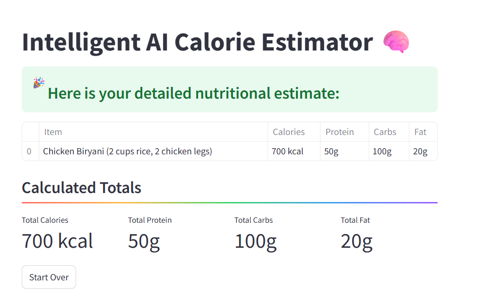

# 🧠 Intelligent AI Calorie Estimator (Agentic)

An **agentic, image-based food calorie estimator** powered by [Gemini 1.5 Pro](https://deepmind.google/discover/blog/google-gemini-next-generation-models/).  
Upload a meal photo — the AI behaves like a smart assistant: it reasons, identifies food items, and interacts with you to fill in only the most critical gaps before generating a personalized calorie and macro breakdown.

---

## 📍 Live Demo

🔗 [Try it on Streamlit]([https://calorie-estimator-agent.streamlit.app/])

---

## 📸 Demo

  

---

## 🚀 Features

✅ Upload a photo of any meal  
✅ Gemini 1.5 Pro acts as an intelligent food analysis agent  
✅ Agentic interaction: AI follows up with only essential questions  
✅ Smart fat attribution logic (e.g., pan-frying oil)  
✅ Clean Streamlit interface  
✅ Per-item JSON-based macro breakdown  
✅ Full meal nutrition: Calories, Protein, Carbs, Fat  
✅ Chain-of-Thought prompting for accuracy  

---

## 🔧 Tech Stack

- **Frontend:** Streamlit  
- **AI Backend:** Google Gemini 1.5 Pro API  
- **Language:** Python 3.11  
- **Prompting Strategy:** Agentic Chain-of-Thought + follow-up refinement  

---

## 🧪 How It Works

1. **Upload Photo:** Snap or upload a picture of your food.
2. **AI Analysis Begins:** The agent detects components, makes estimations, and asks for only what it needs.
3. **User Answers Briefly:** You provide quick answers (e.g., type of oil, amount of meat).
4. **Final Nutrition Breakdown:** The app calculates calories, protein, carbs, and fat for each food item and totals them.

---

## 🛡️ Disclaimer

This tool provides **approximate** nutritional estimates and should not be used for medical or clinical purposes.

---

## 📬 Contact

Made with ❤️ by [Your Name](https://www.linkedin.com/in/your-profile)  
Contributions and feedback welcome!
